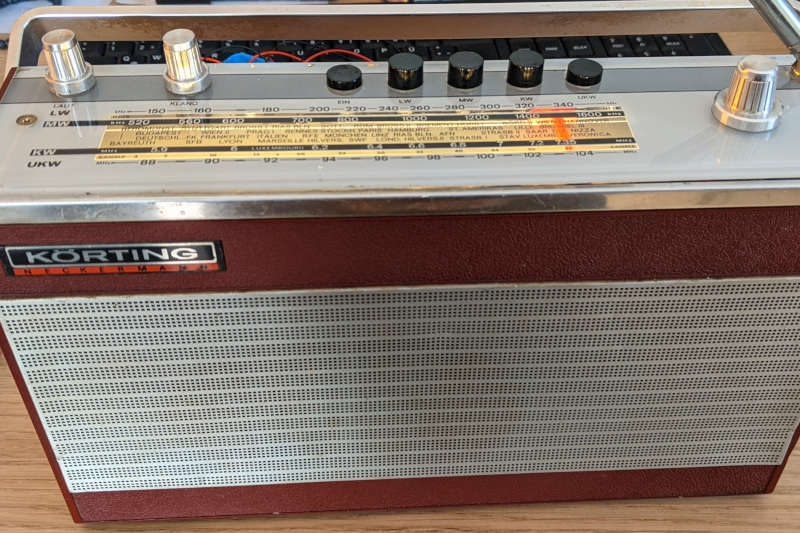
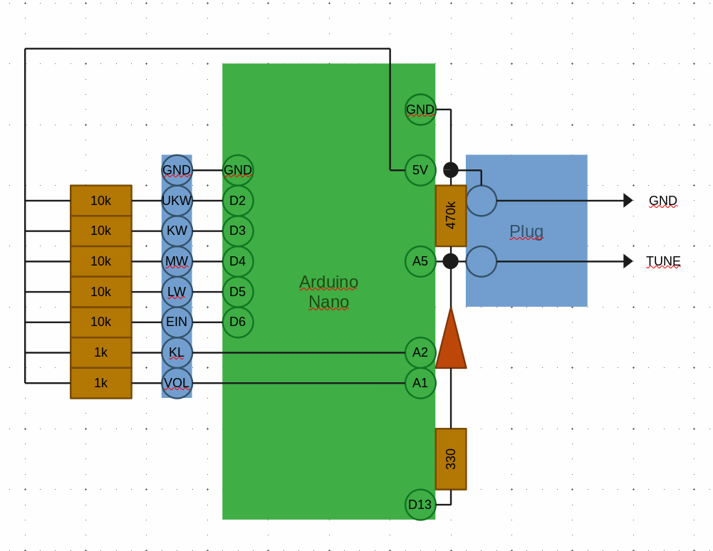
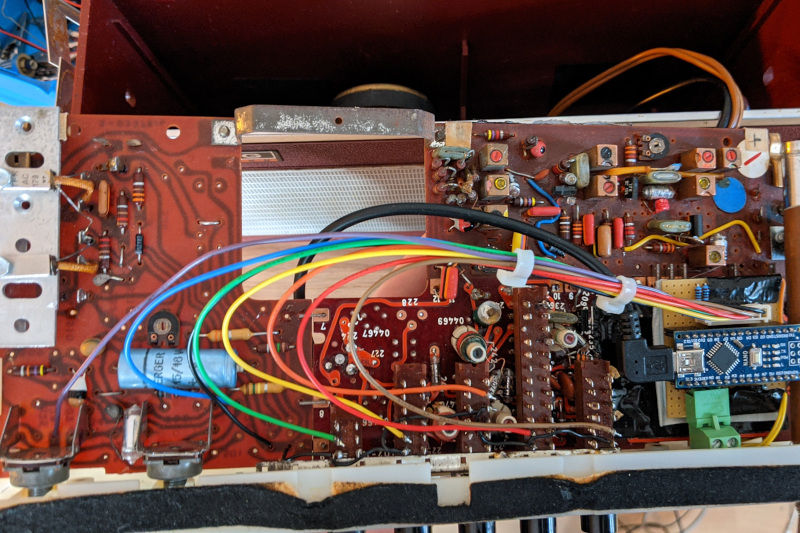
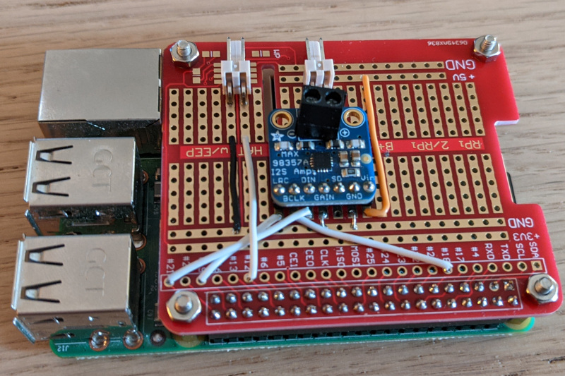
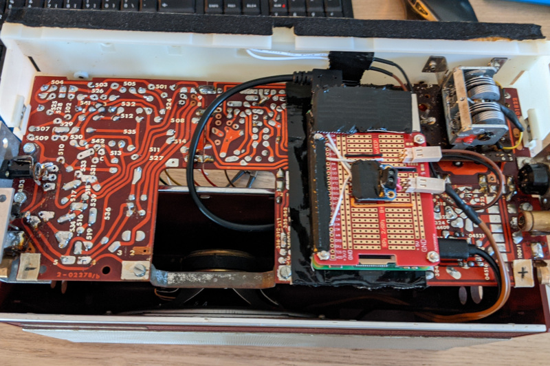

# Retro Radio

For a role playing game, set in the 60s, I had the idea: Why not have a real 60s radio as a prop that
plays music from that time era. And if you need more intense music, tune over to the next station.

So the idea was born to take and old radio, update its hardware where necessary and have the look and
feel of an old radio with modern functionality.

This project is by no means considered to be a guide. It is mostly a write up of what I did, to give
you an idea how you could approach your project. There were some parts that were not as straight forward
(like how to meassure the capacitance of a capacitator).

And it is also a guide for me to remember what I did.

## Parts Overview

* The heart piece is a **Rasberry Pi** (act surprised now). I took a model `3B`, because I had it, and it is
  almost oversized for the job it is going to do.
* I use an **Arduino Nano** to meassure all hardware buttons and knobs of the radio. The problem with the Pi
  is, that it does not have any ADC pins, so this is where the Nano comes in. 
* The Nano communicates with the Pi via **USB**. This also has the advantage that you would be able to flash
  it without having to take the radio apart.
* The [Adafruit MAX98357](https://www.adafruit.com/product/3006) is the **amplifier** that makes everything boom.
  I was lucky that the original speaker still did a perfect job, so I used it with this amp. The sound is ok
  and especially lacks in the bass. There are better bluetooth speakers out there, but the sound is even better
  than I expected from such an old device.
* Everything is powered via an **USB powerbank**. I was lucky enough to find the [Poweradd EnergyCell 5000](https://www.ipoweradd.com/prod_view.aspx?TypeId=10&Id=462&Fid=t3:10:3).
  It has the perfect diameter to fit into the former battery compartment without sliding around. It makes the
  radio run for 4-6 hours.

# Arduino Nano

I used a simple perfboard. The sketch is a to-scale version of where everything is placed on the board. 

**Note** that Pins D7 and D8 are *not* connected to the perfboard. When soldering a socket, remove the pins there.

## Left side

On the **left side** there is an 8-pin plug that connects to all buttons (On/Off and band selection) and potentiometers (volume and sound) of the radio. The size of the resistors do not really matter that much:
  * The 10kΩ are just pull-up resistors for the buttons – anything in that order of magnitude will probably work fine.
  * The 1kΩ resistors prevent the potentionmeters from creating a short circuit. Taking something lower, will just drain more energy – taking something higher will decrease the resolution of volume selection.

## Right side

The **right side** is the one that will require more tinkering.

(I'm also sorry to everyone who has more than my highschool knownledge and has
to endure my juvenile explanations on how electronics work.)

We meassure the capacitance of the variable capacitor by applying a high-frequency rectangular pulse via pin 13 and meassuring the average voltage
on the analogue pin. From what I found this is basically how a capacitance meter works.

* My radio had a tuner with 4 capacitators. I decided to solder them together
  with wire. This should give you a better and more stable reading.
* The `330Ω` is there to limit current drain from `D13` to below `20mA`. It should be as low as possible, but not below `250Ω`. I did not have a `250Ω` resistor so I chose the next highest. Selecting it lower will potentially damage the pin in the long run. And the current the pin can drain, without the resistor, seems to skew over time, leading to changing meassurements.
* The `470kΩ` resistor is something you need to fiddle with and it depends on your variable capacitor. It is there to limit how fast the capacitator can discharge. If it was too low, the capacitator could discharge completely during the low phase of the rectangular pulse and we could not determine is capacitance. If it was too high, the capacitator would not discharge at all (ideal case) or unpredictably over the air and the Nano's pin (realistic case). This would also leave us with an invalid or unreliable reading. 
  
    The best way to **figure out this resistors size** is to set everything up on a breadboard, watch the serial output and test different resistors. What you want is a `Cap` value that changes when turning the variable capacitor. Especially watch the low values – if different positions of the variable capacitor return the same result, you will see it there. You need to use a higher resistor then.
    The other thing you want to look out for is the difference between the lowest and the highest `Cap` value. You want the difference to be as high as possible. Choosing a lower resistor could improve your meassurements in this case.

    With my tuner, I meassure a value between 550 and 850, which is a high enough
    resolution to have a reliable tuner.

* The diode is added to prevent `D13` from draining any current during the discharge phase.

## Flashing Arduino Nano

The code running on the Nano is rather simple. We read some digital pins (for the buttons) and analog pins (for the knobs).

You will likely have to adapt most of the parameters, because your system is different.

But in the end the Nano should send a continious stream of readings that you should see on Arduinos Serial Monitor.

# Amplifier

Adafruit has an exceptional guide how to get the [MAX98357 amp running on Raspberry](https://learn.adafruit.com/adafruit-max98357-i2s-class-d-mono-amp/assembly).
I have nothing to add to it.

# Raspberry

I bought a Hat for Rasberry Pi and soldered the amp, a plug for the speakers and a plug for the LED lighting on it.

# Software

## Prerequisits

    sudo apt-get install libcap-dev
    python3 -m pip install python-vlc string-color pyglet python-prctl pyyaml psutil --user

Set alsa to a sensible volume. Call `alsamixer` and set the main volume to `80%` or whatever fits for you.

## myUtil.py

The most important part in `myUtil.py` is the part that translates the capacitator readings to actual frequencies.
You will need to fine tune those and adapt them to your radio. My recommendation is to do the fine tuning as one of the last steps,
because changing a wire could lead to different readings.

## configure default.yaml

This is where you configure your radio stations. The format should be rather intuitive.

## Add Start Script

This automatically starts the script on boot.

    sudo cp myradio.service /etc/systemd/system/myradio.service
    sudo chown root:root /etc/systemd/system/myradio.service
    sudo systemctl enable myradio.service

    # now either reboot or start the service once by executing
    sudo systemctl start myradio.service

# In case of problems

## For logs

    journalctl -f -u myradio

## Debugging

To see the GUI you need to start the program directly from the shell.

    # first stop the daemon
    sudo systemctl stop myradio.service

    cd ~/radio
    python3 main.py

This will show you all radio stations and the current settings received from the hardware.
Hope that helps.

# Content

Here are some ideas what to play on the radio in true retro style:

* https://archive.org/details/archiveofcontemporarymusic
* https://somafm.com/secretagent/

# What you could do better

If I was doing the project again this is what I might also consider doing.

* Connect the antenna and meassure it. I think it would be awesome if reception of a station would get better if you wiggle the antenna.
